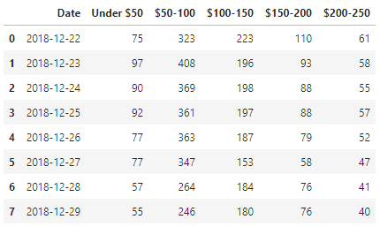
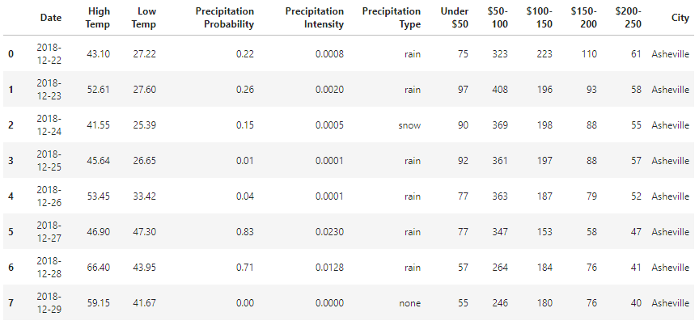
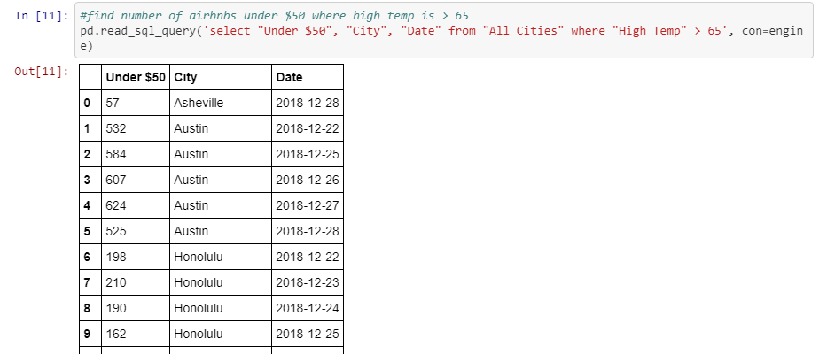

# Travel Agency Database
The travel agency database is the result of an ETL process that combines Airbnb and forecast data for nine cities throughout the United States.  

## E - Extract
From [Inside Airbnb](http://insideairbnb.com/get-the-data.html) we downloaded calendar.csv.gz for the following locations: 
Asheville, Austin, Chicago, Hawaii, Nashville, New Orleans, Seattle, San Francisco, Washington DC
After extracting the CSV files, we renamed each one after its corresponding city (ex. Asheville_calendar.csv).

We used [Dark Sky](https://darksky.net/dev) for forecast data, which required the geographic coordinates of each city.  
For coordinates, we used the [geopy Python module](https://pypi.org/project/geopy/).  

## T - Transform
With a city's CSV loaded into a Pandas DataFrame, we converted the Date column into a datetime object in order to locate the available listings for the next week.  
Next, we strip the $ off of the price and bin the prices in increments of $50, creating a table with the next week of dates and the count of available Airbnb rentals per each price range.  

We located date, temperature, and precipitation data in the JSON object returned from our Dark Sky API request, and we created a DataFrame with the next week of dates and the forecast data for each day.  
We then merged the Airbnb table with the forecast table for a combination of all our data for that city.  
After adding a City column to each table, we appended all tables together to create a DataFrame with all data for all cities.

## L - Load
After connecting to a SQLite database and auto-mapping the table structures, load each table into the database. 
Query the database to filter results.

## Instructions:
After extracting CSV files from Resources folder, please replace "calendar" with respective city names below:
* Asheville_calendar
* Austin_calendar
* Chicago_calendar
* Hawaii_calendar
* Nashville_calendar
* NewOrleans_calendar
* SanFrancisco_calendar
* Seattle_calendar
* WashingtonDC_calendar

Then, simply run [Load_SQLite.ipynb](Load_SQLite.ipynb) with Jupyter Lab/Notebook to generate a SQLite database with tables for each city and a table with all cities.

Note: for best results visit [Inside Airbnb](http://insideairbnb.com/get-the-data.html) and download the new calendar.csv.gz for each city listed above.
